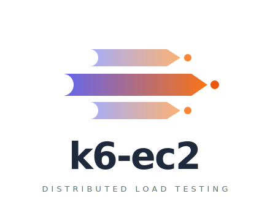
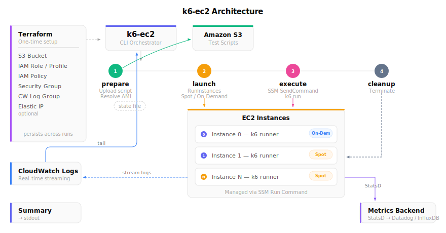

<p align="center">
  
</p>

<p align="center">A CLI tool that runs k6 load tests on EC2 instances as seamlessly as running k6 locally.<br>It abstracts away SSM connections and automates the entire workflow — from instance launch to cleanup.</p>

## How It Works

k6-ec2 is made up of two parts: **Terraform Module** and **CLI**.

```
Terraform Module (one-time)          CLI (per-test)
========================          ========================
IAM Role / Instance Profile       launch:  Resolve AMI, RunInstances
IAM Policy (CLI operator)            |
Security Group                    execute: SSM SendCommand → k6 run
CloudWatch Log Group                 |
Elastic IP (optional)             cleanup: TerminateInstances
```

**Terraform Module** creates the prerequisite infrastructure that persists across test runs. The CLI does not create these resources.

**CLI** orchestrates per-test EC2 instances. It launches instances, transfers scripts and runs k6 via SSM, streams logs, and terminates instances when done.

Both are required. The Terraform Module sets up the foundation; the CLI runs on top of it.

<p align="center">
  
</p>

## Features

- **SSM Run Command** — No SSH required, integrated with CloudWatch Logs
- **Distributed Execution** — Run k6 in parallel across multiple EC2 instances (just set `parallelism`)
- **Spot Instances** — Automatic fallback to on-demand
- **Terraform Module** — One-step infrastructure setup (IAM, SG, CloudWatch)
- **Pipeline Commands** — Run the full lifecycle with `run`, or control each phase independently
- **CLI Overrides** — Override `parallelism`, `instance-type`, `region`, `timeout` via flags without editing YAML

## Quick Start

```bash
# 1. Install
go install github.com/gr1m0h/k6-ec2/cmd/k6-ec2@latest

# 2. Set up infrastructure (one-time)
cd terraform/examples
terraform init && terraform apply \
  -var="vpc_id=vpc-xxx" \
  -var='subnet_ids=["subnet-aaa"]'

# 3. Generate config and fill in Terraform outputs
k6-ec2 init -o testrun.yaml

# 4. Run
k6-ec2 run -f testrun.yaml
```

## CLI

### Full Lifecycle

`run` executes all three phases in one command:

```bash
k6-ec2 run -f testrun.yaml
```

This is equivalent to running `launch` → `execute` → `cleanup` sequentially.

### Pipeline Commands

Each phase can be run independently. State is passed between commands via a state file (default: `.k6-ec2-state.json`).

```bash
# Phase 1: Resolve AMI, launch EC2 instances
k6-ec2 launch -f testrun.yaml

# Phase 2: Transfer script via SSM, run k6
k6-ec2 execute -f testrun.yaml

# Phase 3: Terminate instances
k6-ec2 cleanup -f testrun.yaml
```

Each command only validates the config fields it actually needs:

| Command | Required Config Fields |
| :--- | :--- |
| `launch` | `name`, `runner.parallelism`, `execution.subnets` |
| `execute` | `name`, `script`, `execution.timeout` |
| `cleanup` | `cleanup` |
| `run` / `validate` | All fields |

This means you can use a minimal config for commands that don't need all fields. For example, `launch` does not require `script`.

#### Using Pre-existing Instances

If you have EC2 instances launched outside of k6-ec2 (e.g., by Terraform or another tool), you can skip `launch` and run k6 directly:

```bash
# Run on existing instances (no state file needed)
k6-ec2 execute -f testrun.yaml \
  --instance-ids i-abc123,i-def456 \
  --script ./test.js

# Terminate specific instances
k6-ec2 cleanup --instance-ids i-abc123,i-def456 --force
```

Instances must have SSM agent running and the IAM instance profile attached.

### Utility Commands

| Command | Description |
| :--- | :--- |
| `k6-ec2 validate -f config.yaml` | Validate config file (all fields) |
| `k6-ec2 logs --test-name X -f` | Stream CloudWatch Logs |
| `k6-ec2 init -o config.yaml` | Generate a sample config file |
| `k6-ec2 version` | Show version |

### CLI Flag Overrides

Frequently changed values can be overridden via CLI flags without editing the YAML file:

| Flag | Short | Available In |
| :--- | :--- | :--- |
| `--parallelism` | `-p` | `run`, `launch` |
| `--instance-type` | | `run`, `launch` |
| `--region` | | `run`, `launch`, `execute` |
| `--timeout` | | `run`, `execute` |
| `--cleanup` | | `run` |

```bash
# Override parallelism and instance type for this run
k6-ec2 run -f testrun.yaml -p 8 --instance-type c5.2xlarge

# Override region
k6-ec2 launch -f testrun.yaml --region us-west-2
```

### Global Flags

| Flag | Default | Description |
| :--- | :--- | :--- |
| `--log-level` | `info` | Log level (`debug`, `info`, `warn`, `error`) |

## Configuration

```yaml
name: my-load-test
labels:
  team: platform
  env: staging

script:
  localFile: ./scripts/test.js
  # localDir: ./scripts              # Directory with multiple files
  # entrypoint: main.js              # Required with localDir
  # inline: |                        # Or embed the script inline
  #   import http from 'k6/http';
  #   export default function() { http.get('https://test.k6.io'); }

runner:
  instanceType: c5.xlarge
  parallelism: 4
  iamInstanceProfile: k6-ec2-runner
  # ami: ami-xxxxxxxxxxxxxxxxx     # Default: latest Amazon Linux 2023
  # k6Version: latest              # Default: latest
  # rootVolumeSize: 20             # Default: 20 (GiB)
  spot:
    enabled: true
    fallbackToOnDemand: true
    # maxPrice: "0.10"             # Default: on-demand price
  # env:
  #   K6_BATCH: "20"
  # arguments: ["--vus", "10"]
  # userDataExtra: |
  #   echo "custom setup"

execution:
  subnets: [subnet-xxx]
  securityGroups: [sg-xxx]
  assignPublicIP: true
  region: ap-northeast-1
  timeout: 30m
  # eipAllocationIDs:              # For WAF IP-based allowlisting
  #   - eipalloc-xxxxxxxxxxxxxxxxx

output:
  statsd:
    address: "datadog-agent.service.local:8125"
    enabledTags: true
    namespace: "k6."

cleanup: always  # always | on-success | never
```

### Configuration Reference

| Field | Default | Description |
| :--- | :--- | :--- |
| `name` | (required) | Test run identifier. Used for EC2 instance Name tags and CloudWatch log streams. |
| `labels` | `{}` | Key-value labels for metadata (reserved for future use). |

**script** — k6 test script source (exactly one of `localFile`, `localDir`, or `inline` required).

| Field | Default | Description |
| :--- | :--- | :--- |
| `script.localFile` | — | Local file path. Transferred to instances via SSM. |
| `script.localDir` | — | Local directory path. Archived as tar.gz and transferred via SSM. |
| `script.entrypoint` | — | Entry point file within `localDir`. Required when using `localDir`. |
| `script.inline` | — | Inline script content. Transferred to instances via SSM. |

**runner** — EC2 instance and k6 execution settings.

| Field | Default | Description |
| :--- | :--- | :--- |
| `runner.instanceType` | `c5.xlarge` | EC2 instance type to launch. |
| `runner.parallelism` | `1` | Number of EC2 instances to launch (1-100). |
| `runner.ami` | latest AL2023 | AMI ID. If omitted, resolves the latest Amazon Linux 2023 AMI. |
| `runner.k6Version` | `latest` | k6 version to install from GitHub Releases. |
| `runner.rootVolumeSize` | `20` | EBS root volume size in GiB (gp3, encrypted). |
| `runner.iamInstanceProfile` | — | IAM instance profile name. Required for SSM and CloudWatch access. |
| `runner.env` | `{}` | Environment variables exported to the k6 process. |
| `runner.arguments` | `[]` | Additional CLI arguments passed to `k6 run`. |
| `runner.userDataExtra` | — | Custom shell script injected into UserData (runs after k6 install, before execution). |
| `runner.spot.enabled` | `false` | Request Spot Instances. |
| `runner.spot.maxPrice` | on-demand price | Maximum Spot bid price. |
| `runner.spot.fallbackToOnDemand` | `false` | Retry with On-Demand if Spot capacity is unavailable. |

**execution** — Network and runtime settings.

| Field | Default | Description |
| :--- | :--- | :--- |
| `execution.subnets` | (required) | Subnet IDs. Instances are distributed round-robin. |
| `execution.securityGroups` | `[]` | Security group IDs. Must allow SSM agent traffic (port 443). |
| `execution.assignPublicIP` | `false` | Assign a public IP to each instance. |
| `execution.region` | — | AWS region for all API calls. |
| `execution.timeout` | `30m` | Timeout for the entire test run (launch through cleanup). |
| `execution.eipAllocationIDs` | `[]` | Pre-allocated Elastic IP allocation IDs to associate. Count must be >= `parallelism`. |

**output** — Metrics backend.

| Field | Default | Description |
| :--- | :--- | :--- |
| `output.statsd.address` | — | StatsD endpoint (`host:port`). Adds `--out statsd` to k6. |
| `output.statsd.enabledTags` | `false` | Enable tag support in StatsD output. |
| `output.statsd.namespace` | — | Metric name prefix (e.g., `k6.`). |

**cleanup** — Instance termination policy.

| Value | Description |
| :--- | :--- |
| `always` (default) | Always terminate instances after the test. |
| `on-success` | Terminate only if k6 exits successfully. Keep instances on failure for debugging. |
| `never` | Never terminate. Requires manual `k6-ec2 cleanup --force`. |

## Terraform Module

### Why is Terraform needed?

The CLI creates and manages EC2 instances for each test run, but it does **not** create the supporting infrastructure those instances depend on:

| Resource | Created By | Purpose | Lifecycle |
| :--- | :--- | :--- | :--- |
| IAM Role / Instance Profile | **Terraform** | EC2 instances need permissions for SSM, CloudWatch | Persists across test runs |
| IAM Policy (CLI operator) | **Terraform** | CLI user/role needs permissions to launch instances, send SSM commands | Persists across test runs |
| Security Group | **Terraform** | Egress-only SG for runner instances | Persists across test runs |
| CloudWatch Log Group | **Terraform** | k6 execution logs | Persists across test runs |
| Elastic IP | **Terraform** | WAF IP-based allowlisting (optional) | Persists across test runs |
| WAF v2 IP Set | **Terraform** | Allowlist runner IPs in CloudFront WAF (optional) | Persists across test runs |
| EC2 Instances | **CLI** | Run k6 load tests | Created and terminated per test |
| SSM Commands | **CLI** | Execute k6 on instances | Per test |

Without Terraform (or equivalent manual setup), the CLI will fail because the required IAM roles and security groups do not exist.

### Elastic IP and WAF Allowlisting

When load testing a target behind WAF (e.g., CloudFront), the runner instances' IP addresses must be allowlisted. Since the CLI creates and terminates EC2 instances per test, their IP addresses change every run — WAF rules can't track them.

**Elastic IPs (EIPs)** solve this. They are static IP addresses that persist across test runs:

```
Terraform (one-time)                CLI (per-test)
================                    ================
1. Create EIPs (eip_count=4)        3. Launch EC2 instances
2. Register EIPs in WAF IP Set      4. Associate EIPs with instances
                                     5. Run k6 (traffic from EIP addresses)
                                     6. Terminate instances (EIPs auto-disassociate)
                                        → EIPs remain for next test run
```

Setup:

1. Set `eip_count` to match your `parallelism` in the Terraform module
2. Use the example in `terraform/examples/main.tf` to create a WAF v2 IP Set with the EIPs
3. Add the IP set as an allow rule in your CloudFront WAF WebACL
4. Set `execution.eipAllocationIDs` in your config to the Terraform output `eip_allocation_ids`

```bash
# Terraform
terraform apply -var="eip_count=4"

# Config (testrun.yaml)
execution:
  eipAllocationIDs:
    - eipalloc-aaa
    - eipalloc-bbb
    - eipalloc-ccc
    - eipalloc-ddd
```

If your target does not use WAF IP-based allowlisting, EIPs are not needed. Set `eip_count = 0` (default) and omit `eipAllocationIDs`.

### Setup

```bash
cd terraform/examples
terraform init && terraform apply \
  -var="vpc_id=vpc-xxx" \
  -var='subnet_ids=["subnet-aaa"]'
```

### Outputs

After `terraform apply`, use the outputs to populate your `testrun.yaml`:

| Output | Maps To |
| :--- | :--- |
| `instance_profile_name` | `runner.iamInstanceProfile` |
| `security_group_id` | `execution.securityGroups[]` |
| `subnet_ids` | `execution.subnets[]` |
| `cli_policy_arn` | Attach to your CI/CD role |
| `eip_allocation_ids` | `execution.eipAllocationIDs[]` (if using EIPs) |

### Module Variables

| Variable | Default | Description |
| :--- | :--- | :--- |
| `name` | `k6-ec2` | Name prefix for all resources. |
| `vpc_id` | (required) | VPC ID for the security group. |
| `subnet_ids` | (required) | Subnet IDs for runner instances. |
| `eip_count` | `0` | Number of Elastic IPs. Set to match `parallelism` for WAF allowlisting. |
| `log_retention_days` | `14` | CloudWatch log retention. |
| `enable_spot` | `true` | Spot instance default in sample config output. |
| `tags` | `{}` | Additional tags for all resources. |
